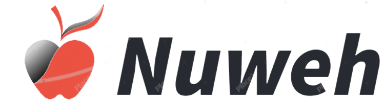

# To-Do-list
<div align="center">
  <!-- You are encouraged to replace this logo with your own! Otherwise you can also remove it. -->
  
  <br/>

  <h3><b>Microverse README Template</b></h3>

</div>

<!-- TABLE OF CONTENTS -->

# 📗 Table of Contents

- [📖 About the Project](#about-project)
  - [🛠 Built With](#built-with)
    - [Tech Stack](#tech-stack)
    - [Key Features](#key-features)
  - [🚀 Live Demo](#live-demo)
- [💻 Getting Started](#getting-started)
  - [Setup](#setup)
  - [Prerequisites](#prerequisites)
  - [Install](#install)
  - [Usage](#usage)
  - [Run tests](#run-tests)
  - [Deployment](#triangular_flag_on_post-deployment)
- [👥 Authors](#authors)
- [🔭 Future Features](#future-features)
- [🤝 Contributing](#contributing)
- [⭐️ Show your support](#support)
- [🙏 Acknowledgements](#acknowledgements)
- [❓ FAQ (OPTIONAL)](#faq)
- [📝 License](#license)


<!-- PROJECT DESCRIPTION -->

# To-Do-list<a name="about-project"></a>

>  Single page application that allows users to keep track of their tasks.

**[To-Do-list]** is a single page application that allows users to keep track of their tasks. Users can add the task and also check the checkbox if the task has been completed.

## 🛠 Built With <a name="built-with"></a>

### Tech Stack <a name="tech-stack"></a>

<details>
  <summary>HTML</summary>
  <ul>
    <li><a href="#">HTML</a></li>
  </ul>
</details>

<details>
  <summary>CSS</summary>
  <ul>
    <li><a href="#">CSS</a></li>
  </ul>
</details>

<details>
<summary>JAVASCRIPT</summary>
  <ul>
    <li><a href="#">JAVASCRIPT</a></li>
  </ul>
</details>

<!-- Features -->

### Key Features <a name="key-features"></a>

- Clean and interactive
- Single Page Application

<p align="right">(<a href="#readme-top">back to top</a>)</p>


<!-- GETTING STARTED -->

## 💻 Getting Started <a name="getting-started"></a>

To get a local copy up and running, follow these steps.

### Prerequisites

In order to run this project you need:
- Git installed in desktop
- Code editor of your choice i.e; Visual Studio Code
- Browser of your choice i.e; Mozilla Firefox ,google chrome, etc
- Terminal of your choice i.e; Git Bash
<!--
Example command:

```sh
 gem install rails
```
 -->
### Setup

Clone this repository to your desired folder:
- use the git clone command with this [link](git@github.com:Lornakaboro/To-Do-list.git)
- cd into Awesome-booksEs6
- Switch branch using this command `git checkout create-to-do-list`
- Open index.html in your browser
- You will be able to see a TO-DO website that dynamically load user's to do list .
<p align="right">(<a href="#readme-top">back to top</a>)</p>
<!-- AUTHORS -->

## 👥 Authors <a name="authors"></a>

👤 **Author1**

- GitHub:  [@githubhandle](https://github.com/Lornakaboro)
- Twitter: [@twitterhandle](https://twitter.com/KaboroLorna)
- Linkedin [@linkedinprofile](https://www.linkedin.com/in/lorna-kaboro-23620b242/)
<p align="right">(<a href="#readme-top">back to top</a>)</p>


<!-- CONTRIBUTING -->

## 🤝 Contributing <a name="contributing"></a>

Contributions, issues, and feature requests are welcome!

Feel free to check the [issues page](https://github.com/Lornakaboro/nutrition-website/issues).

<p align="right">(<a href="#readme-top">back to top</a>)</p>

<!-- SUPPORT -->

## ⭐️ Show your support <a name="support"></a>

If you like this project please give it a⭐️!

<p align="right">(<a href="#readme-top">back to top</a>)</p>

<!-- ACKNOWLEDGEMENTS -->

## 🙏 Acknowledgments <a name="acknowledgements"></a>

I would like to thank:
- Teammates
- Mentors
- Youtube tutorials
- Microverse guides

<p align="right">(<a href="#readme-top">back to top</a>)</p>

<!-- FAQ (optional) -->

<p align="right">(<a href="#readme-top">back to top</a>)</p>

<!-- LICENSE -->

## 📝 License <a name="license"></a>

This project is [MIT](./LICENSE) licensed.

<p align="right">(<a href="#readme-top">back to top</a>)</p>
